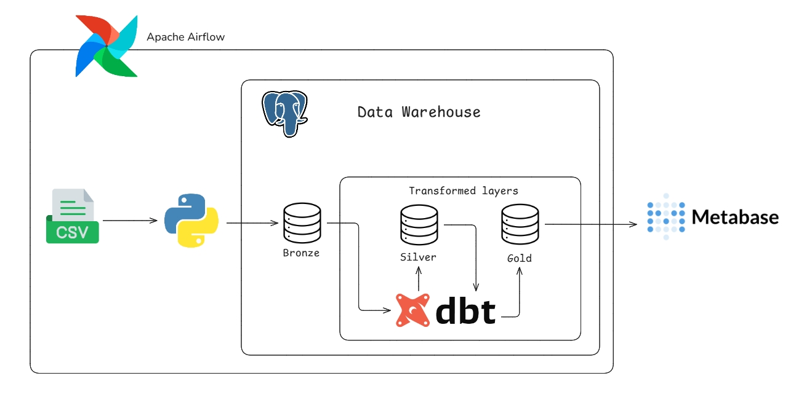
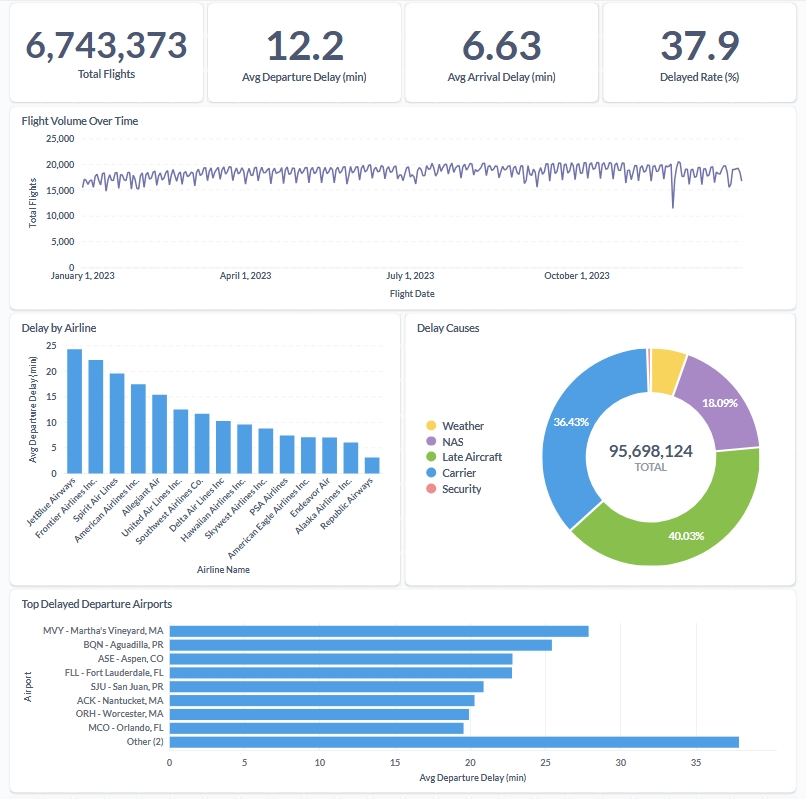

# US Flight 2023 Data Pipeline

An end-to-end data engineering pipeline processing ~6 million US domestic flight records from 2023. Implements a medallion architecture (Bronze -> Silver -> Gold) on PostgreSQL, orchestrated with Airflow and transformed with dbt, with results visualized in Metabase.

## Pipeline Architecture



## Tech Stack

- **Python** - chunk-based ingestion and technical column normalization
- **pandas** - memory-efficient CSV reading while preserving source values as text
- **PostgreSQL** - lightweight data warehouse
- **dbt** - SQL transformations, data modeling, and data tests
- **Apache Airflow** - pipeline orchestration
- **Metabase** - dashboarding and data visualization
- **Docker Compose** - local containerized environment
- **SQLAlchemy / psycopg2** - database setup and bulk loading with PostgreSQL `COPY FROM STDIN`

## Data Pipeline

1. Airflow checks that the raw CSV file exists.
2. Python reads the CSV in 500,000-row chunks and bulk-loads it into `bronze.raw_flights` using PostgreSQL `COPY FROM STDIN`.
3. dbt builds the `silver` layer by cleaning, typing, and deduplicating the raw data.
4. dbt builds the `gold` layer as analytics-ready fact and dimension tables.
5. dbt tests validate key fields and relationships.
6. Metabase connects to PostgreSQL for dashboarding and analysis.

## Data Warehouse Layers

- **Bronze**: source values preserved as `TEXT`, with only technical column naming and ingestion metadata (`_ingested_at`, `_source_file`)
- **Silver**: dbt view `stg_flights` that trims, handles blank values, casts data types, and removes duplicates
- **Gold**: materialized star-schema tables for analytics
  - `fact_flights`
  - `dim_airline`
  - `dim_airport`
  - `dim_date`
  - `dim_aircraft`

## Project Structure

```text
US_Flight_2023/
|-- data/raw/                 # Raw flight CSV data
|-- dags/                     # Airflow DAG definition
|-- dbt_project/              # dbt models, tests, and configuration
|-- ingestion/                # Python ingestion script
|-- image/                    # Diagrams and dashboard screenshots
|-- docker-compose.yml        # PostgreSQL, Airflow, and Metabase services
|-- Dockerfile.airflow        # Custom Airflow image
|-- init-db.sql               # PostgreSQL database initialization
|-- requirements.txt          # Python dependencies
`-- README.md
```

## Metabase Dashboard



## How to Run

Start the local services:

```bash
docker compose up -d
```

Open the tools:

- Airflow: `http://localhost:8080`
- Metabase: `http://localhost:3000`
- PostgreSQL: `localhost:5433`

Run the Airflow DAG:

```text
us_flight_pipeline
```

The DAG runs CSV ingestion, dbt transformations, and dbt tests.

## Notes

Apache Airflow is intentionally used here to simulate a production-grade orchestration layer and demonstrate familiarity with industry-standard tooling.
